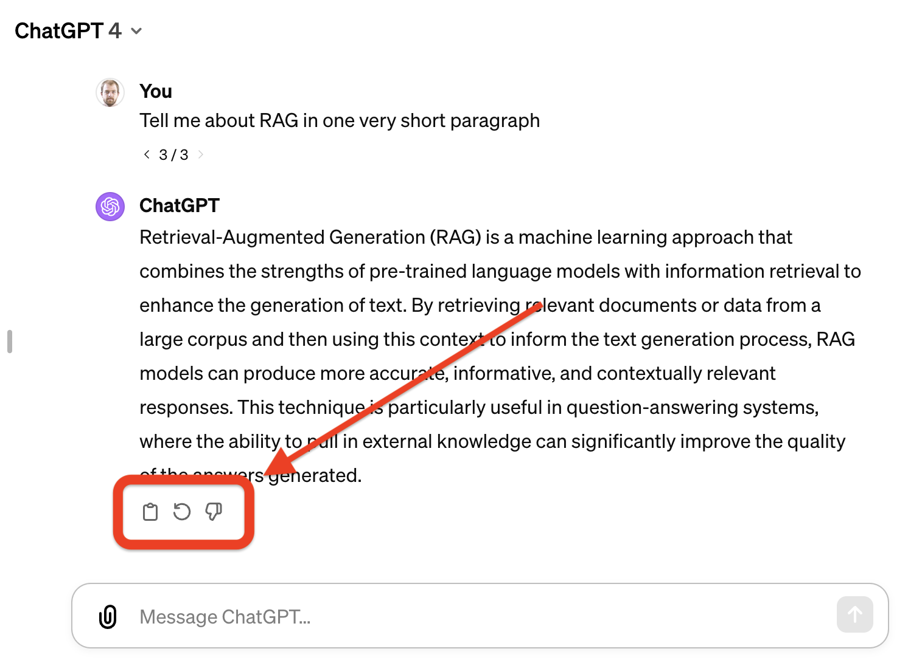

# Typescript is a perfect fit for your RAG app


When it comes to building applications using Retrieval-Augmented Generation (RAG) many full-stack developers assume they need to start by learning Python and its extensive ML and GenAI ecosystem. But, Typescript (or Javascript if that’s your thing) is a perfect fit for this type of application.

In this post we’ll look at the defining challenges of writing a RAG application and see how Typescript’s strengths are perfectly aligned with this problem. 


## First of all, you don’t need Python

**Let's get this out of the way: Python is a great language with a rich tool ecosystem, but for the majority of RAG applications Python isn’t necessary.**

While Python's libraries and frameworks are indeed powerful for _training_ models, the reality is that you're more likely to consume existing models than train your own. Leveraging pre-trained models through libraries and APIs is the crux of RAG application development, a domain where TypeScript shines.

Many of the most popular Gen AI libraries (ie [LangChain](https://js.langchain.com) and [LlamaIndex](https://ts.llamaindex.ai/)) have recognized this fact and released Typescript implementations of their toolkit. Expect to see the Typescript Gen AI ecosystem continue to grow as Gen AI becomes increasingly mainstream.


## Prompt Engineering is where you’ll spend your time

At the heart of any retrieval-augmented generation (RAG) application lies the art and science of prompt engineering—a  process that involves designing and refining the inputs (prompts) given to large language models (LLMs) to make the most accurate, relevant, and contextually appropriate responses. 

```typescript
const prompt =
    PromptTemplate.fromTemplate(`Answer the question
    based only on the following context:
    {context}

    Question: {question}`);
```

This process is important because the quality of the output generated by an LLM is directly influenced by how well the prompt is constructed. A well-engineered prompt can dramatically improve the effectiveness of the generative model, making prompt engineering arguably the most critical aspect of building a RAG application.

```typescript
const chain = RunnableSequence.from([
    {
        context: retriever.pipe(formatDocumentsAsString),
        question: new RunnablePassthrough(),
    },
    prompt,
    model,
    new StringOutputParser(),
]);

const stream = await chain.streamLog(question);
```

The TypeScript ecosystem is full of tools and libraries that facilitate rich prompt engineering and inference. Frameworks like LangChain and tools for interacting with APIs from OpenAI or Vertex AI are readily accessible in the JavaScript ecosystem. Moreover, utilities like LangSmith for refining prompts and integrated logging mechanisms ensure that developers have everything they need to craft and optimize interactions with AI models.


## Orchestrating API calls is what will make your app smart

At the heart of RAG apps lies the ability to fetch, process, and synthesize information from various data sources. The “Retrieval” portion of RAG is what sets your application apart from naive ChatGPT queries. By pulling in knowledge relevant to your users’ needs, you can provide a tailored and superior experience, and this will generally be accomplished by interacting with APIs and knowledge bases.

```typescript
const messages =  [
    ...prompt, 
    [{role: 'user': content: 'Tell me about RAG'}]
]
const res = await openai.chat.completions.create({
    messages,
    model: 'gpt-3.5-turbo',
    temperature: 0.7,
})
```

TypeScript excels at orchestrating API calls and handling responses, seamlessly consolidating disparate data into cohesive, actionable insights. This ability to efficiently manage asynchronous operations and network requests is inherent to TypeScript, thanks to its event-driven nature and robust support for `Promises` and `async/await` syntax.

## User experience is king

User experience can make or break a RAG application, where the dynamic and often unpredictable nature of generated content presents unique challenges for user interface (UI) and user experience (UX) design. The stochasticity (unpredictability) inherent in the responses of generative models requires interfaces that can gracefully handle and present varying outputs in a coherent and user-friendly manner. 



Additionally, the necessity for user feedback loops to gauge and improve the performance of generative models makes it important to design interfaces that actively engage users and encourage interaction. Given these applications' computational requirements, optimizing for streaming and minimizing latency are critical to maintaining a seamless user experience. Ensuring that the application remains responsive and interactive, even as it performs complex back-end operations, is paramount to user satisfaction and overall application success.

TypeScript, with its roots deeply embedded in web technologies, is unparalleled in crafting responsive and interactive user interfaces. The ecosystem offers a variety of frameworks and libraries, such as React, Vue, and Angular, which enable you to build applications that not only look great but also perform exceptionally well, even in real-time, latency-sensitive environments. Moreover, TypeScript can run both on the client and server side, making it easier to build amazing applications quickly.


## Dewy handles document ingestion and indexing

Document ingestion and indexing is an area where Python's mature Gen AI ecosystem has set it apart from Typescript. Until recently, the most commonly used libraries for preparing documents for RAG have been Python-based, and managing this process has been challenging:

* Libraries like LangChain give you a hundred ways to do the same thing and no guidance on which is best
* Orchestrating document processing and vector indexing in a robust, fault tolerant way is challenging ([more on this](https://dewykb.github.io/blog/rag-for-real))
* Querying and ranking extracted information is complex and it can be difficult to understand why your results aren’t relevant to the context

These challenges are why we created [Dewy](https://github.com/DewyKB/dewy). 

```typescript    
const document = await dewy.kb.addDocument({
    collection: 'receipts',
    url: document_url,
});
```

Dewy is a standalone knowledge base that simplifies the complex process of extracting and querying your documents. Dewy fills in the last piece of the RAG puzzle, allowing you to build applications from start to finish quickly using the tools you’re already familiar with.


## Conclusion

The development landscape for RAG applications is evolving, with TypeScript leading the charge in accessibility, functionality, and efficiency. This ecosystem not only provides a comprehensive suite of tools for interacting with advanced AI models but also excels in the critical areas of API integration, user interface development, and data processing. 

If you're embarking on the journey of creating a RAG application, TypeScript offers a compelling, versatile, and powerful toolkit that aligns perfectly with the demands of modern app development.