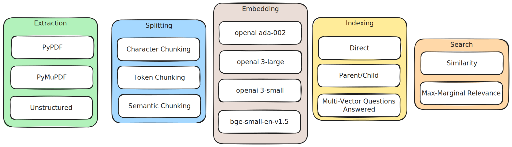
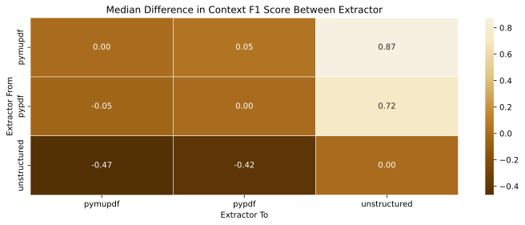
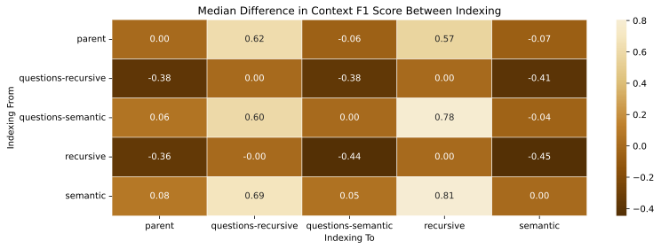
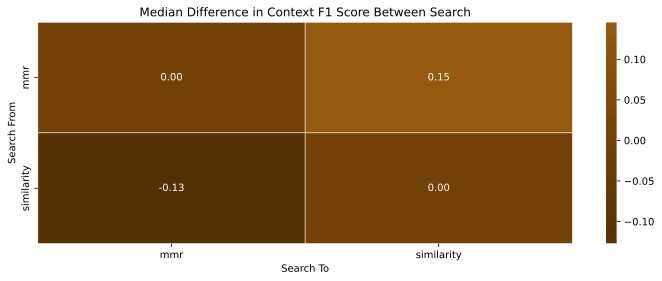
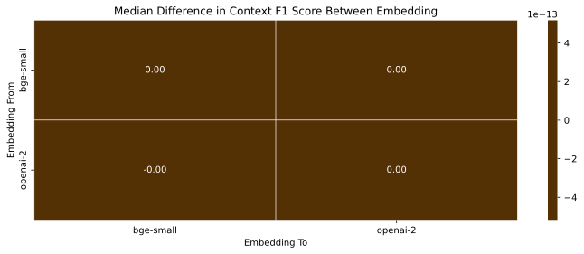

There is a lot of content on getting started with Retrieval Augmented Generation (RAG), and numerous posts on various forms of “advanced” RAG.
LangChain lists 8 different PDF loaders, 4 different text splitters, and a variety of techniques you can add such as Parent-Document Retrieval and Multi-Vector indexing.
It is easy to be paralyzed with doubt – which of these should you use?

If you’re wondering which of these techniques are best for your domain, the long answer is – you should understand which techniques may help your documents and run experiments on your data to see which of those help.

:::tip

If you're in a hurry, the short answer is that how you extract information matters most
Embeddings and advanced splitting and indexing strategies don't help (or actively hurt) retrieval.

:::

To understand the importance of different factors and prioritize implementation of corresponding techniques within Dewy (the open-source knowledge base we’re developing), we ran some experiments on different configurations.
We’re posting these to hopefully save you some time by using these results as a starting point, and possibly using some of the methodology from this post for your own measurements.

{/* truncate */}

## Experimentation

There are a variety of frameworks for evaluating RAG and LLM usage, such as [TruLens][trulens] and [RAGAS][ragas] – at the time of writing LangSmith supports evaluation but doesn’t consider the context, making it less suited for evaluating RAG.
The general pattern is to record the question and answer (and often the retrieved contexts) and then use an LLM to grade the responses.
Typically, you may ask for grades along different metrics – such as “are the retrieved contexts relevant to the question” or “is the generated answer grounded in the retrieved context”.
This approach lets you measure the performance across a large set of generated responses, and fits well with the existing tracing systems like [LangSmith][langsmith].
For this article, I used RAGAS.

The data set I’m using is the [History of Alexnet](https://github.com/run-llama/llama-datasets/tree/main/llama_datasets/history_of_alexnet).
This data set includes a PDF representing the source content (the document or documents to index and retrieve) and a set of 160 questions and answers.
For your experiments, it’s best to have your LLM application record actual questions and possible golden answers – generated by a human or using a larger model and/or larger context.

All of the frameworks mentioned support running the experiments out-of-band.
This allows you to record the actual questions and answers your users are asking, and then run evaluation after the fact to assess the quality of the answers you’ve served up.
This is very useful for monitoring your LLM application.

RAGAS provides a variety of [metrics][ragas_metrics].
For these experiments, I’m only measuring the following metrics related to retrieval.

[Context Precision](https://docs.ragas.io/en/latest/concepts/metrics/context_precision.html)
: Whether the context items relevant to the ground-truth answer are ranked higher than those irrelevant.

[Context Recall](https://docs.ragas.io/en/latest/concepts/metrics/context_recall.html)
: The proportion of sentences in the ground-truth answer attributed to the retrieved context.
  This uses the ground-truth answer as a proxy for the "correct" context.

To simplify comparisons in this post, we use the geometric mean of precision and recall.
This is often called the “f1 score”, but since the RAGAS metrics context recall and precision are slightly different, we’ll call this the “context f1”.

:::note

The code for the experiments is in [the `DewyKB/dewy` GitHub project](https://github.com/DewyKB/dewy/tree/main/experiments).

:::

## Results

For our experiments, we ran using 3 different extractors ([pypdf][pypdf], [pymupdf][pymupdf] and [unstructured][unstructured]), 5 different chunking and indexing strategies ([recursive chunking][recursive], [parent-document chunking][parent_document], [semantic chunking][semantic], and [questions-answered multi-vector embedding][questions_answered] with both recursive and semantic chunking), 2 different embeddings (OpenAI [ada-002][openai_ada002] and [bge-en-small][bge_small_en]) and 2 different search strategies (similarity and maximum-marginal relevance).
We ran the experiment and evaluation on the cross-product of all of these factors.

The results are available in a [zip file][results_zip] and the [analysis notebook][notebook] used to produce the charts is available in Google Colab.
For each of the choices we show a heatmap comparing the median of the relative differences Context F1 between the choices.

### Extraction

Our suspicion was that extraction would play a significant role in the results.
After all, if the wrong text is extracted from a PDF, or it is extracted in a confusing manner there isn’t much that can be done to retrieve the right content.

The results largely supported this.
In this visualization you can see that switching from `pymupdf` to `unstructured` produces an 87% increase in f1 score, and changing from `pypdf` to `unstructured` produces a 72% increase.

### Chunking & Indexing

On the indexing front, the results were somewhat surprising.
We expected more sophisticated chunking strategies like `semantic` to outperform the basic `recursive` chunking.
But the results suggest that `recursive` generally outperforms the other techniques.
As you can see, `recursive` indexing produces context f1 scores 81% better than `semantic`, and 56% better than parent indexing.

Generating the questions-answered is a relatively expensive process (applying an LLM during indexing) and didn’t seem to significantly improve upon the baseline chunking.

In the future, we’d like to rerun these experiments on larger datasets to see if these advanced indexing techniques become more important in different cases.
Until then, this suggests that for simple RAG use cases, simple indexing strategies like `recursive` work well.

### Search

Many vector store retrievers support basic similarity search as well as a “maximum marginal relevance” or MMR.
This is a technique to retrieve more diverse chunks with the hopes of producing richer contexts.
We expected MMR to outperform similarity, but in our experiments we saw the opposite - MMR reduced f1 scores by 13%.

Our hypothesis is that because the dataset has a single PDF, there isn’t much benefit to increased diversity.
This is another experiment we’d like to re-run on different datasets in the future.

### Embeddings

On embeddings, we expected the larger (and better) embeddings from OpenAI ada-002 with 1536 dimensions to outperform [bge-small-en-v1.5](bge_small_en) which only has 512 dimensions.
While there is technically a difference, it is basically insignificant.

## Conclusion

While it is important to consider (and measure!) the benefits of these techniques on your own documents and questions, the above analysis suggests that the most important thing you can do for your RAG application is ensure you’re extracting the right content.
After that, relatively simple chunking, indexing, and retrieval provides good results.

In the future, we’d like to re-run these experiments with a larger dataset and by feeding the entire set of documents through the models rather than comparing advanced RAG techniques to baseline answers using naive RAG.

Don’t be paralyzed by all the options – nearly any choice you use will allow answering questions over the domain specific data and significantly improve the experience of using your GenAI application.
Providing the right context reduces hallucinations and lets you use GenAI to answer questions about domain specific information.

Dewy makes this easy.
It provides a RAG service with built-in indexing and retrieval built on the lessons from these experiments and more, allowing you to add documents and retrieve relevant contexts with a [simple API](../docs/api/dewy-knowledge-base-api) and then get back to improving your GenAI application!

[trulens]: https://www.trulens.org/
[ragas]: https://docs.ragas.io/en/latest/index.html
[ragas_metrics]: https://docs.ragas.io/en/latest/concepts/metrics/index.html
[langsmith]: https://www.langchain.com/langsmith
[pypdf]: https://pypi.org/project/pypdf/
[pymupdf]: https://pypi.org/project/pymupdf/
[unstructured]: https://pypi.org/project/unstructured/
[recursive]: https://python.langchain.com/docs/modules/data_connection/document_transformers/recursive_text_splitter
[parent_document]: https://python.langchain.com/docs/modules/data_connection/retrievers/parent_document_retriever
[semantic]: https://python.langchain.com/docs/modules/data_connection/document_transformers/semantic-chunker
[questions_answered]: https://python.langchain.com/docs/modules/data_connection/retrievers/multi_vector#hypothetical-queries
[openai_ada002]: https://platform.openai.com/docs/guides/embeddings/embedding-models
[bge_small_en]: https://huggingface.co/BAAI/bge-small-en-v1.5/tree/main
[results_zip]: https://drive.google.com/file/d/1AyfIyYrBf1sJz03cCYdbGrF4th0ed8TL/view?usp=drive_link
[notebook]: [https://colab.research.google.com/drive/1ycGgTPvDRLuEOvK6kOfsxg_nKkki6ncG#scrollTo=VH-7g3CdqSOI]