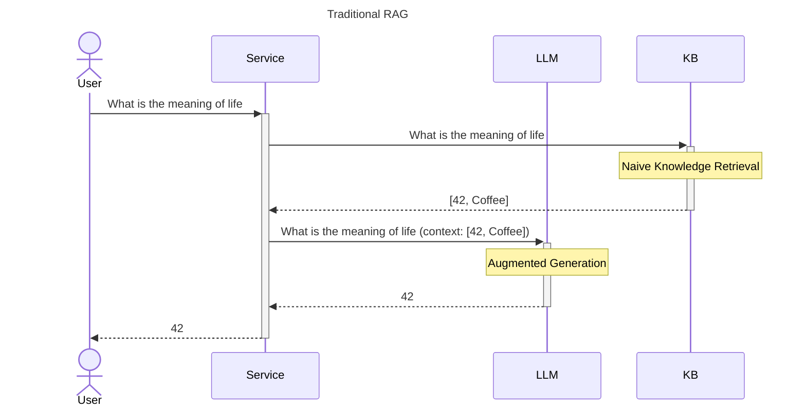
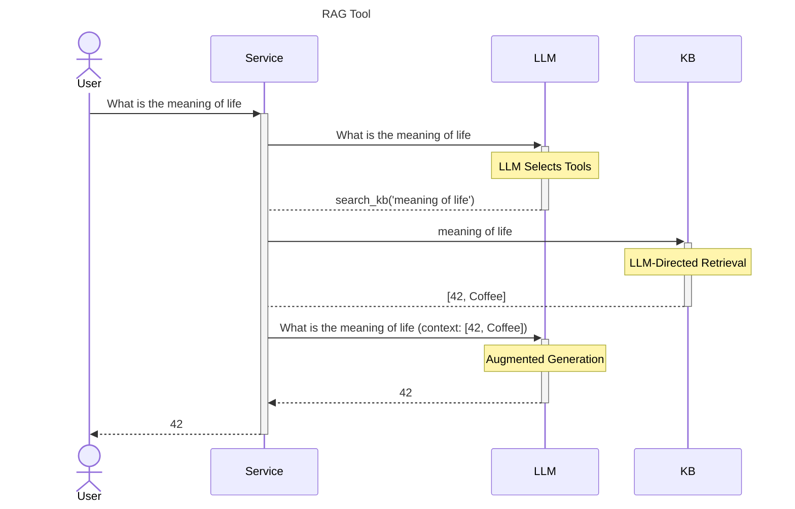
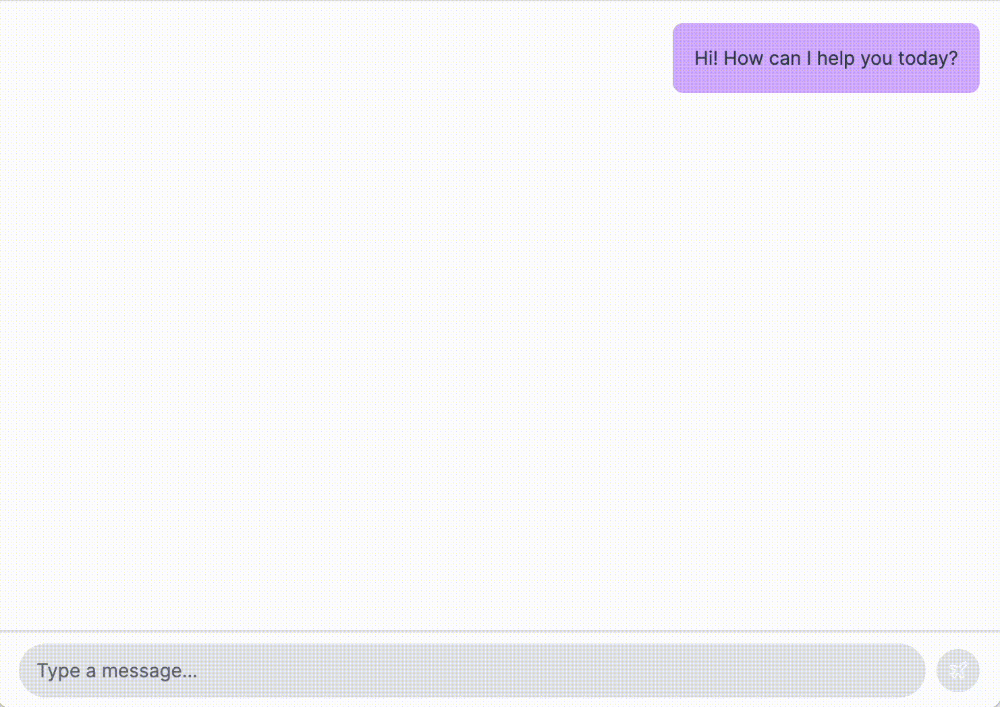

# Building a RAG tool with Vercel's Generative UI components

Retrieval-Augmented Generation (RAG) blends the generative abilities of LLMs with the retrieval of information from diverse knowledge bases (KBs). 
However, traditional implementations of RAG have often relied on pre-scripting the logic for selecting and utilizing these KBs. 
This conventional method, while effective, places limits on the flexibility and adaptability, and performance of the applications.



But consider an alternative: applications that empower the LLM itself to determine which actions are necessary to generate a response. 
This approach not only harnesses the LLM's generative capabilities but also its ability to make contextual decisions on-the-fly, thereby opening up a more dynamic and responsive way to handle knowledge search tasks.
As a result, you can build targeted KB's and use the power of LLMs to write application-specific queries that retrieve better, more relevant results.



To demonstrate this approach, we'll build [a simple chatbot](https://github.com/DewyKB/dewy-ts/tree/main/examples) backed by a custom tool.
The chatbot will have access to a KB containing product information - any time you ask a question the chatbot determines could be answered using this tool it will query the KB and show both the in-progress query and retrieved results as custom UI elements before responding with the retrieved products as context.



We'll use Vercel's [Generative UI library](https://sdk.vercel.ai/docs/concepts/ai-rsc) to render the chat window and Dewy to implement the information storage and retrieval used by our tool and [Dewy](https://github.com/DewyKB/dewy) as the knowledge store backing the tool. 

## Why Dewy and Vercel?

**Vercel's Generative UI library)** is designed to simplify the creation of custom LLM "tools" and to render rich, interactive UI elements that are specific to each tool the LLM chooses to use. 
What this means in practice is that your UI can dynamically adapt to the specific tools chosen by the LLM, displaying tool-specific information and progress indicators to the user.

**Dewy** is an OSS knowledge base with the simplicity and ease-of-use of a document store: insert your documents and Dewy takes care of preparing them for semantic search. 
Dewy's flexibility and ease of use allow developers to focus on building amazing user experiences rather than complex data-processing pipelines.

## Prerequisites

Before diving into the tutorial, ensure you have the following prerequisites covered:

* Basic knowledge of Typescript and React
* A NextJS environment setup on your local machine
* A copy of Dewy running on your local machine (see Dewy's [installation instructions](/docs/GettingStarted/installation) if you need help here).
* Access to the [OpenAI API](https://platform.openai.com/) platform.

## Set up your project

1. **Initialize a new NextJS project**: Create a NextJS app by running the following command in your terminal:

    ```sh
    pnpm dlx create-next-app@canary rag-tool
    ```

    Navigate into your new project directory:

    ```sh
    cd rag-tool
    ```

2. **Install required packages**: Next, we'll install `ai`, Vercel's AI library, `openai`, OpenAI's official JavaScript SDK compatible with the Vercel Edge Runtime, and `dewy-ts`, the Dewy client library. Zod will be used to describe the input types for our custom tool.

    ```
    pnpm install ai openai zod dewy-ts
    ```

3. **Prepare your environment**: Configure your OpenAI key and Dewy endpoint.

    ```
    touch .env.local
    ```

    ```
    OPENAI_API_KEY=xxxxxxxxx
    DEWY_ENDPOINT=localhost:8000
    ```

## Create a custom tool

First, create the custom tool the LLM will use to answer product-related questions.
This tool describes its purpose and parameters so the LLM knows when and how to use it, and defines the implementation and UI logic to complete the tool invocation.

In this case, the tool will "get information about products", given a search query and a result count. When the LLM determines this tool should be used, it will generate the query string and choose how many results are appropriate, then execute the `render` function defined below.

On execution, the tool searches Dewy for relevant products, then calls the LLM again to pick up where it left off. Since this process can take awhile, the `render` function `yield`'s components indicating that the tool is being used and its progress. These components allow the UI to reflect the specific information relevant to this tool's outcomes.

```tsx title="app/productSearch.tsx"
import { z } from 'zod';
import { Dewy } from 'dewy-ts';
import { OpenAIStream } from 'ai'
import { Tokens } from 'ai/react';

import AssistantMessage from './AssistantMessage';
import ResultCard from './ResultCard';
import SearchCard from './SearchCard';

// Create a Dewy client.
const dewy = new Dewy({
    BASE: process.env.DEWY_ENDPOINT
})

// Implement the tool's logic.
// In this case, we search for the given query
// and return the `count` most similar chunks in the KB.
// The returned chunks are used in the `render` method below.
async function searchProducts(query: string, count: number) {
    const context = await dewy.kb.retrieveChunks({
        collection: "product_info",
        query: query,
        n: count,
    })
    return context.text_results.map(c => c.text)
}

// Define the behavior of the product search tool.
export default function productSearch(aiState, openai) {
    return {
        // A description of the tool.
        // This used by the LLM to decide when to use the tool
        description: 'Get information about products',

        // Parameters control how the tool behaves.
        // These values will be picked by the LLM,
        // so be sure to clearly explain what they're
        // used for.
        parameters: z.object({
            query: z.string().describe(```
                A description of a product 
                or what the product can be used for.
            ```),
            count: z.number().describe(```
                The number of products to return.
            ```),
        }).required(),

        // Configure the tool's behavior.
        // This function will be called after the LLM has
        // chosen to use the tool and generated values for
        // the parameters we configured above.
        render: async function* ({ query, count }) {
            // Let the user know we're looking for 
            // products related to their message
            yield <SearchCard query={query} count={count} />

            // Search for products related to the user's question
            const products = await searchProducts(query, count)

            // Update the message history 
            // with the results we found
            aiState.update([
                ...aiState.get(),
                {
                    role: "function",
                    name: "product_search",
                    content: JSON.stringify(products),
                }
            ]);

            // Now reply to the user.
            // The products we retrieved are part of the state 
            // provided as the messages parameter
            const resp = await openai.chat.completions.create({
                model: 'gpt-4-0125-preview',
                messages: aiState.get(),
                stream: true,
            })

            // Stream the results back as they're generated
            const stream = OpenAIStream(resp, {
                onFinal: (completion) => {
                    // Update the conversation history 
                    // once the full response is received
                    aiState.done([
                        ...aiState.get(),
                        {
                            role: "assistant",
                            content: completion,
                        }
                    ])
                }
            });

            // Display the response alongside 
            // the products provided to the model.
            return <div className="flex flex-col gap-2">
                <ResultCard query={query} results={context} />
                <AssistantMessage>
                    <Tokens stream={stream} />
                </AssistantMessage>
            </div>
        }
    }
}
```

## Setup the server-side message handler

Configure a message handling action to receive new messages from the client.
This handler configures the initial state of the chatbot and defines the server's behavior when a message is received from the user.

```tsx title="app/action.tsx"
import { OpenAI } from 'openai';
import { createAI, createStreamableUI, getMutableAIState, render } from 'ai/rsc';

import productSearch from './productSearch';
import AssistantMessage from './AssistantMessage';

// Configure the LLM, in this case OpenAI
const openai = new OpenAI({
  apiKey: process.env.OPENAI_API_KEY,
});
 
async function submitUserMessage(userInput: string) {
  'use server';
 
  // The AI state. This contains our message history,
  // and will be provided to the LLM each time a 
  // chat completion is generated.
  const aiState = getMutableAIState<typeof AI>();
  aiState.update([
    ...aiState.get(),
    {
      role: 'user',
      content: userInput,
    },
  ]);
 
  // Helper function for building streamable UI components.
  const ui = render({
    model: 'gpt-4-0125-preview',
    provider: openai,
    messages: [
      { role: 'system', content: `
        You are a product recommendation engine. 
        Respond only with information about products 
        retrieved using the "product_search" function role.
        `},
      { role: 'user', content: userInput }
    ],

    // This determines how generated text 
    // (as opposed to function calls) will
    // be rendered.
    text: ({ content, done }) => {
      if (done) {
        aiState.done([
          ...aiState.get(),
          {
            role: "assistant",
            content
          }
        ]);
      }
      return <AssistantMessage>{content}</AssistantMessage>
    },

    // Configure the tools available to the LLM
    tools: {
      product_search: productSearch(aiState, openai),
    }
  })
 
  return {
    id: Date.now(),
    display: ui
  };
}
 
// Define the initial state of the AI. It can be any JSON object.
const initialAIState: {
  role: 'user' | 'assistant' | 'system' | 'function';
  content: string;
  id?: string;
  name?: string;
}[] = [];
 
// The initial UI state that the client will keep track of, which contains the message IDs and their UI nodes.
const initialUIState: {
  id: number;
  display: React.ReactNode;
}[] = [{id: 0, display: <AssistantMessage>Hi! How can I help you today?</AssistantMessage>}];
 
// AI is a provider you wrap your application with so you can access AI and UI state in your components.
export const AI = createAI({
  actions: {
    submitUserMessage
  },
  // Each state can be any shape of object, but for chat applications
  // it makes sense to have an array of messages. Or you may prefer something like { id: number, messages: Message[] }
  initialUIState,
  initialAIState
});
```

## Setup the chat UI on the client

Finally, set up the chat UI on the client.
Map over the UI state's messages and insert their `display` property.
Configure a form to update the AI state, then call the `submitUserMessage` server side handler.


```tsx title="app/page.tsx"
'use client'
 
import { useState } from 'react';
import { useUIState, useActions } from 'ai/rsc';
import type { AI } from './action';
import { Input } from '@/components/ui/input';
import { Button } from '@/components/ui/button';
 
import UserMessage from './UserMessage';
import { PlaneIcon } from './icons';

export default function Page() {
  const [inputValue, setInputValue] = useState('');
  const [messages, setMessages] = useUIState<typeof AI>();
  const { submitUserMessage } = useActions<typeof AI>();
 
  return (
    <>
      <div className="flex-1 overflow-auto px-4 mt-4">
        <div className="grid gap-4 md:gap-8">
          {
            messages.map((message) => (
              <div key={message.id}>
                {message.display}
              </div>
            ))
          }

        </div>
      </div>

      <form onSubmit={async (e) => {
        e.preventDefault();

        // Add user message to UI state
        setMessages((currentMessages) => [
          ...currentMessages,
          {
            id: Date.now(),
            display: <UserMessage>{inputValue}</UserMessage>,
          },
        ]);

        // Submit and get response message
        const responseMessage = await submitUserMessage(inputValue);
        setMessages((currentMessages) => [
          ...currentMessages,
          responseMessage,
        ]);

        setInputValue('');
      }}>
        <div className="border-t-2">
          <div className="flex items-center h-14 px-4">
            <Input
              className="rounded-full flex-1 min-w-0 bg-gray-200 dark:bg-gray-800"
              placeholder="Type a message..."
              value={inputValue}
              type="text"
              onChange={(event) => {
                setInputValue(event.target.value)
              }}
            />
            <Button className="ml-2 h-8 w-8 rounded-full bg-gray-200 dark:bg-gray-800" size="icon">
              <PlaneIcon className="h-4 w-4" />
              <span className="sr-only">Send message</span>
            </Button>
          </div>
        </div>
      </form>
    </>
  )
}
```

To keep this post from going any longer than it is already, several basic UI components have been omitted, but you can checkout the full implementation in the [examples directory](https://github.com/DewyKB/dewy-ts/tree/main/examples/rag-tool-vercel) of the Dewy repo.

## Conclusion

In conclusion, this blog post has guided you through the process of building a Retrieval-Augmented Generation (RAG) tool using Vercel's Generative UI components. This approach moves away from the traditional methods of pre-scripting logic for selecting and utilizing knowledge bases. By empowering the LLM to determine which knowledge bases are necessary and how best to use them, we've showcased a more dynamic, efficient, and user-centric way of handling information retrieval tasks.

By utilizing Dewy as our knowledge base, we've emphasized the importance of a flexible, easy-to-use platform for storing, organizing, and retrieving information. This synergy between Dewy's streamlined data management and Vercel's dynamic UI rendering paves the way for developers to create more intelligent, responsive, and user-friendly applications.

If this tutorial has been helpful and you'd like to help others learn about Dewy, please consider starring [our GitHub repo](https://github.com/DewyKB/dewy)!

