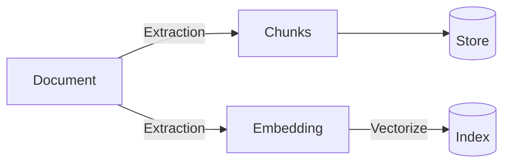

---
sidebar_position: 2
--- 

# Indexing & Retrieval

## Indexing Process

Dewy's indexing mechanism is customizable and central for its retrieval capabilities. Indexing is primarily configured through collections, which determine the choice of embedding model and distance metric. Specifically, the following indexing configuration exists at the collection level (see [`addCollection`](/docs/api/add-collection) for additional details):

| Configuration | Description | Default |
|---|---|---|
| text_embedding_model | Text Embedding Model | `openai:text-embedding-ada-002` |
| text_distance_metric | The distance metric used for similarity searches | `cosine` |

The process of extracting data from documents is dependent on the document type and is informed by the results of [Ragas](https://docs.ragas.io/en/stable/) benchmarks. Although currently limited to text chunks, we plan to expand these capabilities to include images, tables, and other data formats, aiming to offer a more comprehensive indexing solution. 

:::tip
Despite exploring various model-based extraction techniques such as [summarization](https://docs.llamaindex.ai/en/stable/module_guides/loading/documents_and_nodes/usage_metadata_extractor.html), [propositionizing](https://arxiv.org/abs/2312.06648), and extracting [questions answered by the text](https://docs.llamaindex.ai/en/stable/module_guides/loading/documents_and_nodes/usage_metadata_extractor.html), we have found that the modest performance improvements provided by these techniques doesn't justify the signficant increase in ingestion cost they impose.
:::

Chunking configuration and the extraction of embeddings are also guided by benchmarks. This ensures that the chunking parameters and embedding extraction processes are optimized for retrieval, facilitating a balance between precision and performance.

:::tip
If you're interested in our benchmarking, we published some of our high-level findings in a blog post titled "[Extraction Matters Most](/blog/extraction-matters-most)"
:::

## Retrieval Process

Querying in Dewy involves embedding the user's query and then matching this embedded query to the document embeddings based on vector similarity. The configured distance metric plays a critical role in this matching process, ensuring that the most relevant results are identified. 

Queries support several configuration options (see [`retrieveChunks`](/docs/api/retrieve-chunks) for additional details):

| Configuration | Description | Default |
|---|---|---|
| n | The number of chunks to return | `10` |
| include_text_chunk | If text chunks should be returned in the response | `True` |
| include_image_chunks | If image chunks should be returned in the response (not yet implemented) | `True` |
| include_summary | If chunk summaries should be returned in the response (not yet implemented) | `False` |

Once embeddings that closely match the query are identified, they are resolved back to their corresponding chunks. The system then returns the top N chunks, ranked according to their maximum embedding score, ensuring users receive the most relevant and informative responses.

:::tip
Looking forward, Dewy is exploring the introduction of re-ranking options, such as [Mean Reciprocal Rank](https://www.cs.cmu.edu/~jgc/publication/The_Use_MMR_Diversity_Based_LTMIR_1998.pdf) (MRR), to refine the retrieval process further. However, experimentation with MRR has shown that it may not always improve performance and can actually reduce performance in some cases, indicating the complexity of optimizing retrieval mechanisms.
:::

## Future Directions

Dewy is actively investigating several advanced techniques to enrich its indexing and retrieval framework. These include:
* The integration of knowledge graphs, like [GraphRAG](https://www.microsoft.com/en-us/research/blog/graphrag-unlocking-llm-discovery-on-narrative-private-data/), to leverage structured relationships between data points
* The extraction of entities and named terms to provide additional context associated with chunks is under consideration, aiming to improve the specificity and relevance of retrieved information.
* The prospect of multimodal search, encompassing images, tables, and other non-textual data formats.

Through continuous innovation and the integration of advanced techniques, Dewy seeks to remain at the forefront of knowledge base technology, offering a powerful tool for developers and organizations looking to harness the full potential of their unstructured data.